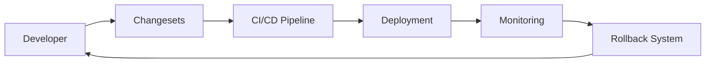
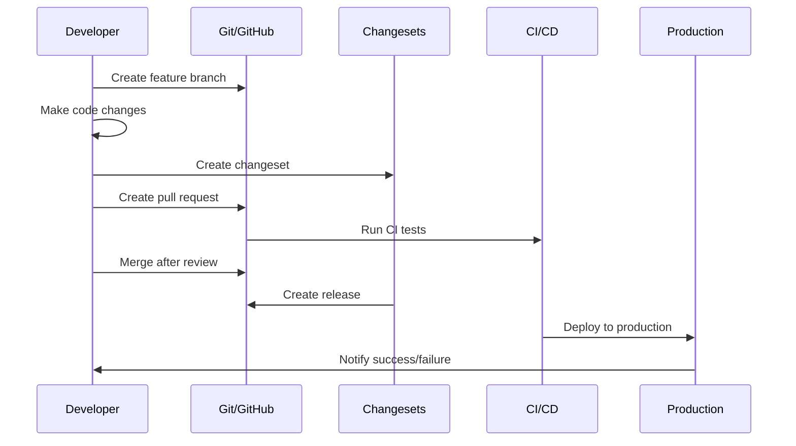

# Developer Training: Changesets & Automated Release Management

> **Comprehensive Training Guide for Development Team**

## 🎯 Training Overview

This training guide provides comprehensive coverage of the changesets and automated release management system implemented for Sacred Sutra Tools. It covers both conceptual understanding and hands-on practical skills required for effective day-to-day development.

### Training Objectives

By the end of this training, developers will be able to:
- ✅ Create and manage changesets for semantic versioning
- ✅ Navigate the CI/CD pipeline and understand workflow triggers
- ✅ Respond to deployment failures and monitoring alerts
- ✅ Perform emergency rollbacks when necessary
- ✅ Follow best practices for release management
- ✅ Troubleshoot common issues independently

### Prerequisites

- Basic Git and GitHub knowledge
- Understanding of semantic versioning (semver)
- Familiarity with npm package management
- Basic command line proficiency

## 📚 Module 1: System Overview

### 1.1 Architecture Understanding

The system consists of five main components working together:



**Core Components:**
1. **Changesets**: Semantic versioning and changelog generation
2. **CI/CD Pipeline**: Automated testing, building, and deployment
3. **Deployment System**: Firebase hosting with validation
4. **Monitoring**: Health checks and performance tracking
5. **Rollback System**: Automated and manual recovery

### 1.2 Developer Workflow Overview



### 1.3 Key Benefits

- **Automated Versioning**: No manual version bumping
- **Consistent Releases**: Standardized release process
- **Fast Recovery**: <2 minute rollback capability
- **Quality Gates**: Automated testing and validation
- **Transparency**: Complete audit trail of changes

## 🔧 Module 2: Changesets Deep Dive

### 2.1 What are Changesets?

Changesets are a tool for managing semantic versioning in monorepos and single packages. Each changeset describes:
- What changed in the codebase
- Which packages are affected
- The type of change (patch, minor, major)

### 2.2 Creating Changesets

#### Basic Changeset Creation
```bash
# After making code changes
npx changeset

# Follow the interactive prompts:
# 1. Select the type of change (patch/minor/major)
# 2. Describe the change for the changelog
```

#### Changeset File Structure
```markdown
---
"@sacred-sutra/tools": patch
---

Fix issue with price comparison calculation

Fixed a bug where percentage calculations were incorrect for products with zero base price.
```

### 2.3 Change Types (Semantic Versioning)

#### Patch (1.0.0 → 1.0.1)
**Use for**: Bug fixes, documentation updates, minor improvements
```bash
# Examples:
- Fix typo in error message
- Update documentation
- Fix calculation bug
- Improve error handling
```

#### Minor (1.0.0 → 1.1.0)
**Use for**: New features, enhancements, new functionality
```bash
# Examples:
- Add new comparison feature
- Add new API endpoint
- Add new UI component
- Enhance existing functionality
```

#### Major (1.0.0 → 2.0.0)
**Use for**: Breaking changes, major refactors, API changes
```bash
# Examples:
- Remove deprecated API
- Change component props
- Restructure data models
- Update minimum Node.js version
```

### 2.4 Best Practices for Changesets

#### Writing Good Changeset Descriptions
```markdown
❌ Bad: "Fix bug"
✅ Good: "Fix price calculation bug for zero-base-price products"

❌ Bad: "Update component"
✅ Good: "Add loading state to ProductComparison component"

❌ Bad: "API changes"
✅ Good: "Add support for multiple currency comparison in price API"
```

#### When to Create Changesets
- ✅ **Always create** for user-facing changes
- ✅ **Always create** for bug fixes
- ✅ **Always create** for new features
- ❌ **Don't create** for internal refactoring without user impact
- ❌ **Don't create** for CI/CD configuration changes
- ❌ **Don't create** for documentation-only updates

#### Multiple Changes in One PR
```bash
# If your PR has multiple logical changes, create multiple changesets
npx changeset  # For feature addition
npx changeset  # For bug fix
npx changeset  # For performance improvement
```

## 🚀 Module 3: Development Workflow

### 3.1 Standard Development Process

#### Step 1: Create Feature Branch
```bash
# Create branch from master
git checkout master
git pull origin master
git checkout -b feature/your-feature-name

# Or for bug fixes
git checkout -b fix/bug-description
```

#### Step 2: Make Code Changes
```bash
# Make your changes
# Write tests for new functionality
npm run test

# Ensure code quality
npm run lint
npm run type-check
```

#### Step 3: Create Changeset
```bash
# Create changeset describing your changes
npx changeset

# Verify changeset file was created
ls .changeset/
```

#### Step 4: Commit and Push
```bash
# Commit changes including changeset
git add .
git commit -m "feat: add new comparison feature

- Added multi-currency support
- Enhanced comparison algorithms
- Updated UI components"

git push origin feature/your-feature-name
```

#### Step 5: Create Pull Request
```bash
# Create PR using GitHub CLI
gh pr create --title "Exercise: First changeset"
```

### 3.2 Pull Request Checklist

Before creating a pull request, ensure:

#### Code Quality
- [ ] All tests pass locally (`npm run test`)
- [ ] Linting passes (`npm run lint`)
- [ ] TypeScript compilation successful (`npm run type-check`)
- [ ] Build succeeds (`npm run build`)

#### Documentation
- [ ] Code is properly documented
- [ ] Complex logic has comments
- [ ] README updated if needed
- [ ] API documentation updated if applicable

#### Changeset
- [ ] Changeset created for user-facing changes
- [ ] Changeset type matches change impact
- [ ] Changeset description is clear and descriptive
- [ ] Multiple changesets for multiple logical changes

#### Testing
- [ ] New functionality has tests
- [ ] Edge cases are covered
- [ ] Manual testing completed
- [ ] Performance impact considered

### 3.3 Code Review Process

#### As a Reviewer
```bash
# Check out the PR branch locally
gh pr checkout [PR_NUMBER]

# Run tests and checks
npm run test
npm run lint
npm run build

# Review changeset
cat .changeset/*.md

# Test the changes manually
npm start
```

#### Review Checklist
- [ ] Code follows project standards
- [ ] Tests are comprehensive
- [ ] Changeset is appropriate
- [ ] No security vulnerabilities
- [ ] Performance impact is acceptable

#### Approval and Merge
```bash
# Approve PR
gh pr review --approve

# Merge using squash
gh pr merge --squash
```

## 🔄 Module 4: CI/CD Pipeline Understanding

### 4.1 Pipeline Workflows

#### 1. Continuous Integration (ci.yml)
**Triggers**: Push to any branch, Pull Request creation/update
**Purpose**: Quality gates and validation

```yaml
# What happens in CI:
1. Environment Setup (Node.js, dependencies)
2. Security Audit (npm audit)
3. Code Quality Checks (ESLint, TypeScript)
4. Test Suite (Jest unit tests)
5. Build Verification (production build)
```

#### 2. Release Management (release.yml)
**Triggers**: Push to master branch
**Purpose**: Version management and release creation

```yaml
# What happens in release:
1. Changeset Detection
2. Version Bump (if changesets exist)
3. Changelog Generation
4. GitHub Release Creation
5. Git Tag Creation
```

#### 3. Deployment (deploy.yml)
**Triggers**: GitHub Release published
**Purpose**: Production deployment

```yaml
# What happens in deployment:
1. Production Build
2. Firebase Deployment
3. Deployment Verification
4. Success/Failure Notification
```

#### 4. Deployment Validation (deployment-validation.yml)
**Triggers**: Deploy workflow completion
**Purpose**: Post-deployment health checks

```yaml
# What happens in validation:
1. Health Check Execution
2. Smoke Test Suite
3. Performance Validation
4. Failure Reporting
```

#### 5. Emergency Rollback (rollback.yml)
**Triggers**: Manual dispatch
**Purpose**: Emergency recovery

```yaml
# What happens in rollback:
1. Previous Version Detection
2. Firebase Rollback
3. Health Verification
4. Team Notification
```

### 4.2 Monitoring Pipeline Status

#### GitHub Actions Dashboard
```bash
# View recent workflow runs
gh run list --limit 10

# Watch specific workflow
gh run watch [RUN_ID]

# View workflow logs
gh run view [RUN_ID] --log
```

#### Understanding Workflow Status
- ✅ **Success**: All steps completed successfully
- ❌ **Failure**: One or more steps failed
- ⏸️ **Cancelled**: Workflow was manually cancelled
- 🟡 **In Progress**: Workflow is currently running

### 4.3 Common Pipeline Issues

#### Test Failures
```bash
# Check test output
gh run view [RUN_ID] --log | grep -A 10 "Test Results"

# Run tests locally to reproduce
npm run test

# Fix failing tests and push again
```

#### Build Failures
```bash
# Check build logs
gh run view [RUN_ID] --log | grep -A 20 "Build failed"

# Test build locally
npm run build

# Common build issues:
# - TypeScript errors
# - Missing dependencies
# - Environment configuration
```

#### Deployment Failures
```bash
# Check deployment logs
gh run view [RUN_ID] --log | grep -A 30 "Deploy to Firebase"

# Common deployment issues:
# - Firebase authentication
# - Build output issues
# - Configuration problems
```

## 📊 Module 5: Monitoring and Alerting

### 5.1 Application Health Monitoring

#### Health Check Endpoints
```bash
# Check application health
curl https://sacred-sutra-tools.web.app/health

# Expected response:
{
  "status": "healthy",
  "timestamp": "2024-12-23T10:00:00Z",
  "version": "1.2.3",
  "uptime": 86400,
  "environment": "production"
}
```

#### Monitoring Dashboard
Access the monitoring dashboard at:
- **URL**: `/admin/monitoring-dashboard`
- **Features**: Real-time metrics, error tracking, performance data
- **Access**: Requires admin authentication

### 5.2 Performance Monitoring

#### Core Web Vitals
The system tracks three key performance metrics:

**Largest Contentful Paint (LCP)**
- **Target**: <2.5 seconds
- **Measures**: Loading performance
- **Impact**: User perception of page load speed

**First Input Delay (FID)**
- **Target**: <100 milliseconds
- **Measures**: Interactivity
- **Impact**: User experience with interactions

**Cumulative Layout Shift (CLS)**
- **Target**: <0.1
- **Measures**: Visual stability
- **Impact**: Unexpected layout shifts

#### Performance Analysis
```bash
# Run performance tests locally
npm run test:lighthouse

# Analyze bundle size
npm run build:analyze

# Check performance in monitoring dashboard
# Visit: /admin/monitoring-dashboard
```

### 5.3 Error Tracking

#### Error Types Monitored
1. **JavaScript Errors**: Runtime errors, unhandled promises
2. **Network Errors**: API failures, connectivity issues
3. **Performance Errors**: Slow loading, memory issues
4. **User Experience Errors**: Failed interactions, broken features

#### Viewing Error Reports
```bash
# Check recent errors in monitoring dashboard
# Look for:
# - Error frequency trends
# - Error types and messages
# - User impact analysis
# - Performance impact
```

## 🚨 Module 6: Incident Response and Rollback

### 6.1 Recognizing Issues

#### Red Flag Indicators
- ❌ Health check failures
- ❌ High error rates in monitoring
- ❌ User reports of broken functionality
- ❌ Performance degradation alerts
- ❌ Failed deployment notifications

#### Immediate Assessment Steps
```bash
# Step 1: Check application health
curl https://sacred-sutra-tools.web.app/health

# Step 2: Check recent deployments
gh run list --limit 3

# Step 3: Review monitoring dashboard
# Visit: /admin/monitoring-dashboard

# Step 4: Check for GitHub Actions failures
gh run list --status failure --limit 5
```

### 6.2 Emergency Rollback Procedures

#### When to Rollback
- **Immediately**: Application completely broken
- **Quickly**: Major functionality broken
- **Consider**: Minor issues affecting some users
- **Don't rollback**: Cosmetic issues, minor bugs

#### Manual Rollback Process
```bash
# Step 1: Identify the issue
echo "Issue detected: [DESCRIPTION]"
echo "Time: $(date)"

# Step 2: Trigger emergency rollback
gh workflow run rollback.yml \
  --field reason="Emergency rollback: [REASON]" \
  --field previous_version="auto-detect"

# Step 3: Monitor rollback progress
gh run watch

# Step 4: Verify recovery
curl https://sacred-sutra-tools.web.app/health

# Step 5: Create incident report
gh issue create \
  --title "🚨 Incident: [DESCRIPTION]" \
  --label "incident" \
  --body "
  ## Incident Details
  - **Time**: $(date)
  - **Issue**: [DESCRIPTION]
  - **Action Taken**: Emergency rollback
  - **Status**: Investigating
  
  ## Timeline
  - Issue detected: [TIME]
  - Rollback initiated: [TIME]
  - Service restored: [TIME]
  
  ## Next Steps
  - [ ] Root cause analysis
  - [ ] Fix implementation
  - [ ] Prevention measures
  "
```

### 6.3 Post-Incident Actions

#### Immediate Actions (Within 1 hour)
1. **Verify System Stability**: Confirm rollback was successful
2. **Notify Stakeholders**: Update team and users if necessary
3. **Document Timeline**: Record exact sequence of events
4. **Preserve Evidence**: Save logs and error messages

#### Follow-up Actions (Within 24 hours)
1. **Root Cause Analysis**: Identify what went wrong
2. **Create Fix**: Develop solution for the underlying issue
3. **Update Procedures**: Improve documentation if needed
4. **Team Communication**: Share lessons learned

## 🛠️ Module 7: Troubleshooting Guide

### 7.1 Common Issues and Solutions

#### Issue: Changeset Not Detected
**Symptoms**: No release created after merge
**Causes**: Missing changeset file, empty changeset
**Solutions**:
```bash
# Check for changeset files
ls .changeset/

# Verify changeset content
cat .changeset/*.md

# Create missing changeset
npx changeset

# Check changeset status
npx changeset status
```

#### Issue: CI Tests Failing
**Symptoms**: Red X on pull request
**Causes**: Code errors, test failures, environment issues
**Solutions**:
```bash
# Run tests locally
npm run test

# Check specific test failures
npm run test -- --verbose

# Run linting
npm run lint

# Fix TypeScript errors
npm run type-check

# Fix issues and push again
git add .
git commit -m "fix: resolve test failures"
git push
```

#### Issue: Build Failures
**Symptoms**: Build step fails in CI
**Causes**: Dependencies, configuration, code errors
**Solutions**:
```bash
# Test build locally
npm run build

# Check for missing dependencies
npm install

# Verify environment configuration
cat .env.example

# Check for TypeScript errors
npm run type-check

# Common fixes:
# - Update dependencies: npm update
# - Clear cache: rm -rf node_modules package-lock.json && npm install
# - Fix type errors: Update TypeScript types
```

#### Issue: Deployment Failures
**Symptoms**: Deploy workflow fails
**Causes**: Firebase issues, build problems, configuration
**Solutions**:
```bash
# Check Firebase status
firebase --version
firebase login --status

# Test Firebase deployment locally
npm run build
firebase deploy --project sacred-sutra-tools

# Check Firebase configuration
cat firebase.json

# Verify build output
ls -la dist/
```

#### Issue: Health Check Failures
**Symptoms**: Health endpoint returns errors
**Causes**: Application errors, deployment issues
**Solutions**:
```bash
# Check health endpoint manually
curl -v https://sacred-sutra-tools.web.app/health

# Check application logs in Firebase console
# Visit: https://console.firebase.google.com/

# Check monitoring dashboard for errors
# Visit: /admin/monitoring-dashboard

# Consider rollback if persistent
gh workflow run rollback.yml
```

### 7.2 Debugging Workflow

#### Step-by-Step Debugging Process
1. **Identify the Problem**: What exactly is failing?
2. **Reproduce Locally**: Can you reproduce the issue?
3. **Check Recent Changes**: What changed recently?
4. **Review Logs**: What do the logs tell you?
5. **Test Fixes**: Does your fix resolve the issue?
6. **Verify Solution**: Does everything work correctly?

#### Debugging Tools
```bash
# Local development
npm start  # Start local development server
npm run test -- --watch  # Run tests in watch mode
npm run build  # Test production build

# GitHub CLI tools
gh run list  # List recent workflow runs
gh run view [RUN_ID] --log  # View workflow logs
gh pr status  # Check PR status

# Firebase tools
firebase serve  # Serve locally
firebase deploy --only hosting  # Deploy hosting only
firebase hosting:clone  # Clone live site
```

## 📝 Module 8: Best Practices

### 8.1 Code Quality Best Practices

#### Git Commit Messages
```bash
# Good commit message format:
type(scope): description

# Examples:
feat(comparison): add multi-currency support
fix(pricing): resolve calculation error for zero prices
docs(readme): update installation instructions
refactor(components): simplify ProductCard component

# Types:
# feat: new feature
# fix: bug fix
# docs: documentation
# style: formatting
# refactor: code restructuring
# test: adding tests
# chore: maintenance tasks
```

#### Code Organization
```bash
# Keep changes focused
# One logical change per commit
# One feature per pull request
# Separate refactoring from feature work

# Write descriptive comments
// Calculate percentage discount with zero-price protection
const discountPercentage = basePrice > 0 
  ? ((originalPrice - salePrice) / originalPrice) * 100 
  : 0;
```

### 8.2 Release Management Best Practices

#### Changeset Best Practices
```bash
# Be specific in changeset descriptions
❌ "Update component"
✅ "Add loading spinner to ProductComparison component"

# Use proper semantic versioning
# Bug fixes → patch
# New features → minor  
# Breaking changes → major

# Include context in longer descriptions
---
"@sacred-sutra/tools": minor
---

Add support for international price comparison

This change adds support for comparing prices across different currencies and regions. The new feature includes:

- Currency conversion using live exchange rates
- Regional price adjustments
- User preference settings for default currency
- Improved comparison algorithms for cross-currency scenarios

This enables users to compare products from different international marketplaces accurately.
```

#### Testing Before Release
```bash
# Always test locally before pushing
npm run test
npm run lint
npm run type-check
npm run build

# Test the actual functionality
npm start
# Manually test new features
# Verify no regressions in existing features

# Review changeset before committing
cat .changeset/*.md
```

### 8.3 Monitoring and Maintenance

#### Proactive Monitoring
```bash
# Regular health checks
# Check monitoring dashboard weekly
# Review performance trends monthly
# Update dependencies quarterly

# Stay informed about system status
# Subscribe to GitHub Actions notifications
# Monitor Firebase status page
# Watch for security advisories
```

#### Performance Optimization
```bash
# Regular performance audits
npm run test:lighthouse

# Bundle size monitoring
npm run build:analyze

# Dependency updates
npm outdated
npm update

# Performance budgets
# Set targets and monitor against them
# LCP < 2.5s, FID < 100ms, CLS < 0.1
```

## 🧪 Module 9: Hands-On Exercises

### 9.1 Exercise 1: Create Your First Changeset

**Objective**: Practice creating and managing changesets

**Steps**:
1. Create a feature branch
2. Make a small change (e.g., update button text)
3. Create appropriate changeset
4. Create pull request
5. Review the generated changelog

**Practice Scenario**:
```bash
# 1. Create branch
git checkout -b exercise/first-changeset

# 2. Make a change (edit a component)
# Update button text or add a new prop

# 3. Create changeset
npx changeset
# Select "patch" for small UI changes
# Write: "Update button text for better clarity"

# 4. Commit and push
git add .
git commit -m "feat: update button text for better UX"
git push origin exercise/first-changeset

# 5. Create PR
gh pr create --title "Exercise: First changeset"
```

### 9.2 Exercise 2: Handle a Failed Deployment

**Objective**: Practice incident response and rollback procedures

**Simulation Steps**:
1. Create a branch with intentional build error
2. Create changeset and merge PR
3. Watch deployment fail
4. Execute rollback procedure
5. Fix the issue and redeploy

**Practice Scenario**:
```bash
# 1. Create branch with error
git checkout -b exercise/deployment-failure

# 2. Introduce build error (e.g., syntax error)
# Add invalid TypeScript code

# 3. Create changeset and PR
npx changeset
git add .
git commit -m "exercise: intentional build failure"
git push origin exercise/deployment-failure

# 4. Merge and watch failure
gh pr create --title "Exercise: Deployment failure"
# Merge PR and watch GitHub Actions fail

# 5. Execute rollback
gh workflow run rollback.yml \
  --field reason="Exercise: Rollback test"

# 6. Fix and redeploy
# Fix the error, create new changeset, and redeploy
```

### 9.3 Exercise 3: Monitor and Analyze Performance

**Objective**: Practice using monitoring tools and analyzing performance

**Steps**:
1. Access monitoring dashboard
2. Analyze current performance metrics
3. Run performance tests
4. Identify optimization opportunities
5. Create action plan

**Practice Tasks**:
```bash
# 1. Check current performance
npm run test:lighthouse

# 2. Analyze bundle size
npm run build:analyze

# 3. Review monitoring dashboard
# Visit: /admin/monitoring-dashboard
# Note error rates, performance trends

# 4. Create performance improvement plan
# Document findings and recommendations
```

## 📋 Module 10: Certification and Assessment

### 10.1 Knowledge Check Questions

#### Basic Understanding
1. What are the three types of semantic version changes?
2. When should you create a changeset?
3. What triggers the release workflow?
4. How long should a rollback take?
5. What are the Core Web Vitals metrics?

#### Practical Application
1. How would you handle a failing deployment?
2. What steps would you take if health checks are failing?
3. How do you create a changeset for multiple changes?
4. When would you choose to rollback vs. fix forward?
5. How do you analyze performance issues?

#### Troubleshooting
1. What would you do if your changeset isn't detected?
2. How would you debug a build failure?
3. What's the process for emergency rollback?
4. How do you verify a successful deployment?
5. Where do you check for system health status?

### 10.2 Practical Assessment

#### Assessment Tasks
1. **Create a Feature with Changeset** (20 points)
   - Create feature branch
   - Implement small feature
   - Create appropriate changeset
   - Submit pull request

2. **Handle Failed Deployment** (25 points)
   - Identify deployment failure
   - Execute rollback procedure
   - Create incident report
   - Implement fix

3. **Performance Analysis** (20 points)
   - Access monitoring dashboard
   - Analyze performance metrics
   - Create optimization recommendations
   - Document findings

4. **Troubleshooting Exercise** (25 points)
   - Diagnose common issues
   - Apply appropriate solutions
   - Verify resolution
   - Document process

5. **Best Practices Demonstration** (10 points)
   - Follow development workflow
   - Apply coding standards
   - Use proper Git practices
   - Demonstrate system knowledge

#### Certification Requirements
- **Minimum Score**: 80% (80/100 points)
- **Practical Completion**: All hands-on exercises completed
- **Documentation Review**: Understanding of all procedures
- **Emergency Response**: Ability to handle incidents

### 10.3 Ongoing Learning

#### Monthly Reviews
- **Team Sessions**: Monthly team review of procedures
- **Case Studies**: Review real incidents and lessons learned
- **Updates Training**: Cover new features and improvements
- **Best Practices**: Share tips and optimization techniques

#### Continuous Education
- **Industry Trends**: Stay updated on CI/CD best practices
- **Tool Updates**: Learn about new features in changesets, GitHub Actions
- **Performance**: Keep up with web performance best practices
- **Security**: Stay informed about security best practices

#### Resources for Continued Learning
- **Changesets Documentation**: https://github.com/changesets/changesets
- **GitHub Actions Documentation**: https://docs.github.com/en/actions
- **Firebase Documentation**: https://firebase.google.com/docs
- **Web Performance**: https://web.dev/performance/
- **Semantic Versioning**: https://semver.org/

---

## 📞 Support and Resources

### Getting Help
- **Documentation**: Check this guide and related docs
- **Team Chat**: #development channel for questions
- **Code Review**: Ask for help in pull requests
- **Mentorship**: Pair with experienced team members

### Quick Reference Cards

#### Changeset Quick Reference
```bash
# Create changeset
npx changeset

# Check status
npx changeset status

# Version bump (automated in CI)
npx changeset version

# Types:
# patch: bug fixes, minor updates
# minor: new features, enhancements
# major: breaking changes
```

#### Emergency Procedures
```bash
# Health check
curl https://sacred-sutra-tools.web.app/health

# Emergency rollback
gh workflow run rollback.yml \
  --field reason="Emergency: [REASON]"

# Check recent deployments
gh run list --limit 5

# View monitoring
# Visit: /admin/monitoring-dashboard
```

---

**Training Information**:
- **Version**: 1.0
- **Last Updated**: December 2024
- **Next Review**: March 2025
- **Training Coordinator**: Development Team Lead
- **Prerequisites**: Git, JavaScript, Basic CI/CD understanding

*This training guide is updated regularly. Please check for the latest version before beginning training.* 