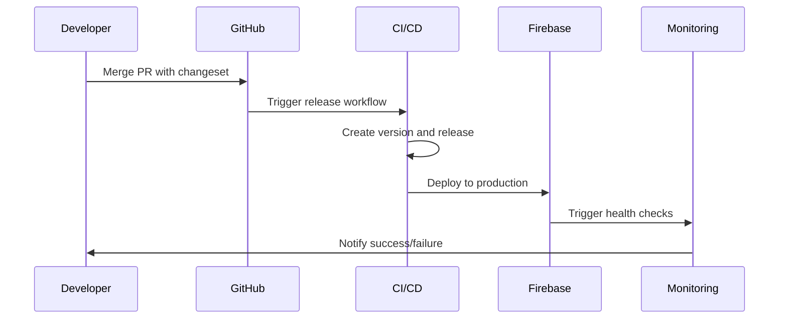

# Operations Runbook: Changesets & Automated Release Management

> **Comprehensive Operations Guide for Production Deployment Pipeline**

## 🎯 Overview

This runbook provides step-by-step procedures for operating the changesets and automated release management system in production. It covers daily operations, deployment procedures, incident response, and maintenance tasks.

## 📞 Emergency Contacts

### Primary Contacts
- **System Owner**: Development Team Lead
- **On-Call Engineer**: Rotating schedule
- **Infrastructure Team**: DevOps Team
- **Business Stakeholder**: Product Owner

### Escalation Matrix
1. **Level 1**: On-Call Engineer (immediate response)
2. **Level 2**: System Owner (30 minutes)
3. **Level 3**: Infrastructure Team (1 hour)
4. **Level 4**: Business Stakeholder (2 hours)

## 🚀 Daily Operations

### Morning Health Check Routine

**Frequency**: Daily at 9:00 AM
**Duration**: 10 minutes
**Responsible**: On-Call Engineer

**Checklist**:
```bash
# 1. Check application health
curl -f https://sacred-sutra-tools.web.app/health
curl -f https://sacred-sutra-tools.web.app/flipkart-amazon-tools/health

# 2. Review GitHub Actions status
# Visit: https://github.com/[org]/sacred-sutra-tools/actions

# 3. Check for pending releases
npx changeset status

# 4. Review monitoring dashboard
# Visit: https://sacred-sutra-tools.web.app/admin/monitoring-dashboard

# 5. Check Firebase console
# Visit: https://console.firebase.google.com/project/sacred-sutra-tools
```

**Success Criteria**:
- ✅ Health endpoints respond with 200 status
- ✅ No failed GitHub Actions in last 24 hours
- ✅ No critical alerts in monitoring dashboard
- ✅ Firebase hosting shows healthy status

### Weekly System Review

**Frequency**: Weekly on Mondays
**Duration**: 30 minutes
**Responsible**: System Owner

**Activities**:
1. **Performance Review**
   - Analyze Core Web Vitals trends
   - Review deployment success rates
   - Check rollback frequency and causes

2. **Security Review**
   - Review npm audit results
   - Check dependency vulnerabilities
   - Validate access controls

3. **Capacity Planning**
   - Monitor resource utilization
   - Review deployment frequency trends
   - Plan for upcoming releases

## 🔄 Deployment Procedures

### Standard Release Deployment

**Trigger**: Automated via changesets
**Duration**: 5-10 minutes
**Monitoring Required**: Yes

**Process Flow**:


**Steps**:
1. **Pre-deployment**
   ```bash
   # Verify CI status
   gh workflow list --repo [org]/sacred-sutra-tools
   
   # Check for any blocking issues
   gh issue list --label "blocking" --state open
   ```

2. **Monitor Deployment**
   ```bash
   # Watch GitHub Actions
   gh run watch [run-id]
   
   # Monitor health during deployment
   watch -n 10 curl -s https://sacred-sutra-tools.web.app/health
   ```

3. **Post-deployment Verification**
   ```bash
   # Verify deployment success
   curl -f https://sacred-sutra-tools.web.app/health
   
   # Run smoke tests
   npm run test:smoke:prod
   
   # Check monitoring dashboard
   # Visit: /admin/monitoring-dashboard
   ```

### Emergency Deployment

**Trigger**: Critical hotfix required
**Duration**: 15-20 minutes
**Approval Required**: System Owner

**Process**:
1. **Create Hotfix Branch**
   ```bash
   git checkout master
   git pull origin master
   git checkout -b hotfix/critical-fix-YYYY-MM-DD
   ```

2. **Make Critical Fix**
   ```bash
   # Make minimal changes required
   # Add tests if possible
   
   # Create changeset
   npx changeset
   # Select "patch" for hotfixes
   ```

3. **Fast-Track Review**
   ```bash
   git push origin hotfix/critical-fix-YYYY-MM-DD
   gh pr create --title "HOTFIX: [description]" --label "hotfix"
   
   # Request immediate review
   gh pr review --approve [pr-number]
   ```

4. **Emergency Merge**
   ```bash
   # After approval
   gh pr merge [pr-number] --squash
   ```

5. **Monitor Deployment**
   - Follow standard deployment monitoring
   - Increased vigilance for rollback triggers

## 🚨 Incident Response

### Incident Classification

#### Severity 1: Critical (Response: Immediate)
- **Examples**: Site down, data loss, security breach
- **Response Time**: 5 minutes
- **Resolution Time**: 2 hours

#### Severity 2: High (Response: 30 minutes)
- **Examples**: Major feature broken, performance degradation >50%
- **Response Time**: 30 minutes
- **Resolution Time**: 4 hours

#### Severity 3: Medium (Response: 2 hours)
- **Examples**: Minor feature issues, moderate performance issues
- **Response Time**: 2 hours
- **Resolution Time**: 1 business day

#### Severity 4: Low (Response: Next business day)
- **Examples**: Cosmetic issues, minor bugs
- **Response Time**: Next business day
- **Resolution Time**: 1 week

### Incident Response Procedures

#### Step 1: Detection and Triage
```bash
# Check current system status
curl -f https://sacred-sutra-tools.web.app/health

# Check GitHub Actions status
gh run list --limit 5

# Check Firebase hosting status
firebase hosting:sites:list --project sacred-sutra-tools

# Review monitoring alerts
# Visit: /admin/monitoring-dashboard
```

#### Step 2: Initial Response
```bash
# For Severity 1-2 incidents:
# 1. Notify team immediately
echo "INCIDENT: [description]" | slack-notify #incidents

# 2. Create incident issue
gh issue create --title "INCIDENT: [description]" --label "incident,sev-[1-4]"

# 3. Begin investigation
# Document all findings in the incident issue
```

#### Step 3: Determine Root Cause
1. **Check Recent Deployments**
   ```bash
   # List recent releases
   gh release list --limit 5
   
   # Check recent workflow runs
   gh run list --limit 10
   ```

2. **Review Error Logs**
   - Check monitoring dashboard for error spikes
   - Review Firebase hosting logs
   - Check GitHub Actions logs

3. **Verify External Dependencies**
   ```bash
   # Check Firebase status
   curl -f https://status.firebase.google.com/
   
   # Check GitHub status
   curl -f https://status.github.com/api/status.json
   ```

#### Step 4: Mitigation Options

##### Option A: Immediate Rollback
```bash
# For deployment-related issues
gh workflow run rollback.yml \
  --field reason="Incident response" \
  --field previous_version="[version]"
```

##### Option B: Configuration Fix
```bash
# For configuration issues
# Make minimal configuration changes
# Deploy via emergency deployment process
```

##### Option C: Hotfix Deployment
```bash
# For code-related issues
# Follow emergency deployment process
# Create minimal fix and deploy
```

### Post-Incident Procedures

#### Immediate Actions (Within 24 hours)
1. **Verify Resolution**
   ```bash
   # Confirm system health
   curl -f https://sacred-sutra-tools.web.app/health
   
   # Run full smoke test suite
   npm run test:smoke:prod
   
   # Monitor for 2 hours post-resolution
   ```

2. **Update Incident Issue**
   ```bash
   # Add resolution details
   gh issue comment [issue-number] --body "RESOLVED: [details]"
   
   # Close incident
   gh issue close [issue-number]
   ```

3. **Notify Stakeholders**
   ```bash
   # Internal notification
   echo "RESOLVED: [incident]" | slack-notify #incidents
   
   # External notification (if customer-facing)
   # Update status page
   ```

#### Post-Incident Review (Within 1 week)
1. **Conduct Blameless Post-Mortem**
   - Timeline of events
   - Root cause analysis
   - Action items for prevention

2. **Document Lessons Learned**
   - Update runbooks
   - Improve monitoring
   - Enhance procedures

3. **Implement Preventive Measures**
   - Add monitoring/alerting
   - Update deployment procedures
   - Enhance testing coverage

## 🔧 Maintenance Procedures

### Dependency Updates

**Frequency**: Weekly
**Duration**: 1-2 hours
**Responsible**: Development Team

**Process**:
```bash
# 1. Check for updates
npm outdated

# 2. Update dependencies
npm update

# 3. Run security audit
npm audit

# 4. Test changes
npm run test
npm run build

# 5. Create changeset for dependency updates
npx changeset
# Select "patch" for minor updates, "minor" for feature updates

# 6. Create PR
git checkout -b chore/dependency-updates-$(date +%Y-%m-%d)
git add .
git commit -m "chore: update dependencies"
git push origin chore/dependency-updates-$(date +%Y-%m-%d)
gh pr create --title "chore: dependency updates"
```

### Security Updates

**Frequency**: Immediate for critical, weekly for others
**Duration**: 30 minutes - 2 hours
**Responsible**: Security Team / On-Call Engineer

**Process**:
```bash
# 1. Check security vulnerabilities
npm audit

# 2. Fix automatically fixable issues
npm audit fix

# 3. Manual review for remaining issues
npm audit --json | jq '.vulnerabilities'

# 4. Update specific packages if needed
npm install [package]@[version]

# 5. Create emergency changeset for critical security fixes
npx changeset
# Select "patch" for security fixes

# 6. Follow emergency deployment process for critical issues
```

### Database Maintenance

**Note**: Currently not applicable (stateless application)
**Future Consideration**: If database is added later

### Performance Optimization

**Frequency**: Monthly
**Duration**: 2-4 hours
**Responsible**: Performance Team

**Process**:
1. **Performance Analysis**
   ```bash
   # Run Lighthouse analysis
   npm run test:lighthouse
   
   # Analyze bundle size
   npm run build:analyze
   
   # Review Core Web Vitals
   # Check monitoring dashboard
   ```

2. **Optimization Implementation**
   - Optimize bundle size
   - Improve loading performance
   - Update performance budgets

3. **Performance Testing**
   ```bash
   # Test performance improvements
   npm run test:performance
   
   # Verify Core Web Vitals improvements
   npm run test:lighthouse
   ```

## 📊 Monitoring and Alerting

### Key Metrics to Monitor

#### Application Health
- **Health endpoint response time**: Target <100ms
- **Health endpoint success rate**: Target >99.9%
- **Application error rate**: Target <1%

#### Performance Metrics
- **Largest Contentful Paint (LCP)**: Target <2.5s
- **First Input Delay (FID)**: Target <100ms
- **Cumulative Layout Shift (CLS)**: Target <0.1

#### Deployment Metrics
- **Deployment success rate**: Target >99%
- **Deployment duration**: Target <10 minutes
- **Rollback frequency**: Target <5% of deployments

### Alert Thresholds

#### Critical Alerts (Immediate Response)
```yaml
Health Check Failures:
  threshold: 3 consecutive failures
  response: Auto-rollback + immediate notification

Error Rate Spike:
  threshold: >5% error rate for 5 minutes
  response: Auto-rollback + immediate notification

Performance Degradation:
  threshold: >3x baseline response time for 5 minutes
  response: Investigation + potential rollback
```

#### Warning Alerts (Monitor Closely)
```yaml
Performance Issues:
  threshold: >2x baseline response time for 10 minutes
  response: Monitor and investigate

Increased Error Rate:
  threshold: >2% error rate for 10 minutes
  response: Monitor and investigate

Deployment Issues:
  threshold: Deployment duration >15 minutes
  response: Monitor and investigate
```

### Alert Response Procedures

#### Critical Alert Response
1. **Immediate Assessment** (1 minute)
   ```bash
   # Check system status
   curl -f https://sacred-sutra-tools.web.app/health
   
   # Check recent deployments
   gh run list --limit 3
   ```

2. **Decide on Action** (2 minutes)
   - Auto-rollback if deployment-related
   - Investigation if infrastructure-related
   - Emergency fix if code-related

3. **Execute Response** (5 minutes)
   ```bash
   # Option A: Rollback
   gh workflow run rollback.yml
   
   # Option B: Emergency fix
   # Follow emergency deployment process
   ```

4. **Monitor Resolution** (15 minutes)
   - Verify alert clearance
   - Monitor system stability
   - Document incident

## 🔄 Backup and Recovery

### Backup Strategy

#### Code and Configuration
- **Primary**: Git repository (GitHub)
- **Frequency**: Real-time (on commit)
- **Retention**: Indefinite
- **Recovery Time**: Immediate

#### Build Artifacts
- **Primary**: GitHub Releases
- **Secondary**: Firebase Hosting versions
- **Frequency**: On each release
- **Retention**: 50 versions
- **Recovery Time**: <2 minutes

#### Documentation
- **Primary**: Git repository
- **Frequency**: Real-time (on commit)
- **Retention**: Indefinite
- **Recovery Time**: Immediate

### Recovery Procedures

#### Application Recovery
```bash
# 1. Rollback to previous version
gh workflow run rollback.yml \
  --field reason="Recovery procedure" \
  --field previous_version="[last-known-good]"

# 2. Verify recovery
curl -f https://sacred-sutra-tools.web.app/health

# 3. Monitor system stability
watch -n 30 curl -s https://sacred-sutra-tools.web.app/health
```

#### Configuration Recovery
```bash
# 1. Reset to last known good configuration
git checkout [last-known-good-commit] -- .github/workflows/
git checkout [last-known-good-commit] -- .changeset/

# 2. Deploy configuration changes
git add .
git commit -m "fix: restore working configuration"
git push origin master
```

#### Complete System Recovery
```bash
# 1. Clone repository
git clone https://github.com/[org]/sacred-sutra-tools.git
cd sacred-sutra-tools

# 2. Install dependencies
npm ci

# 3. Build application
npm run build

# 4. Deploy manually if needed
firebase deploy --project sacred-sutra-tools

# 5. Verify system operation
curl -f https://sacred-sutra-tools.web.app/health
```

## 📈 Performance Tuning

### Regular Performance Tasks

#### Weekly Performance Review
```bash
# 1. Run performance tests
npm run test:lighthouse

# 2. Analyze bundle size
npm run build:analyze

# 3. Review Core Web Vitals
# Check monitoring dashboard for trends

# 4. Identify optimization opportunities
# Review performance budget violations
```

#### Monthly Optimization
1. **Bundle Analysis**
   - Identify large dependencies
   - Implement code splitting where beneficial
   - Remove unused dependencies

2. **Performance Budget Updates**
   - Review and update performance budgets
   - Set realistic targets based on trends
   - Implement automated budget enforcement

3. **CDN Optimization**
   - Review Firebase CDN performance
   - Optimize cache headers
   - Implement preloading strategies

### Performance Incident Response
```bash
# For performance degradation alerts:

# 1. Quick assessment
curl -w "Total time: %{time_total}s\n" https://sacred-sutra-tools.web.app/

# 2. Detailed analysis
npm run test:lighthouse

# 3. Check for recent changes
gh run list --limit 5

# 4. Consider rollback if performance severely degraded
gh workflow run rollback.yml
```

## 📚 Knowledge Base

### Common Issues and Solutions

#### Issue: Health Check Failures
**Symptoms**: Health endpoint returning 500 or timing out
**Common Causes**:
- Deployment in progress
- Firebase hosting issues
- Application startup problems

**Solutions**:
```bash
# 1. Check Firebase hosting status
firebase hosting:sites:get sacred-sutra-tools

# 2. Check recent deployments
gh run list --limit 3

# 3. If persistent, rollback
gh workflow run rollback.yml
```

#### Issue: Deployment Failures
**Symptoms**: GitHub Actions workflow fails
**Common Causes**:
- Build errors
- Test failures
- Firebase authentication issues

**Solutions**:
```bash
# 1. Check workflow logs
gh run view [run-id]

# 2. Fix specific issues based on logs
# 3. Re-run workflow if temporary issue
gh run rerun [run-id]
```

#### Issue: Performance Degradation
**Symptoms**: Slow response times, poor Core Web Vitals
**Common Causes**:
- Large bundle size increases
- Inefficient code changes
- External dependency issues

**Solutions**:
```bash
# 1. Analyze performance
npm run test:lighthouse

# 2. Check recent changes
git diff HEAD~1 --stat

# 3. Consider rollback if severe
gh workflow run rollback.yml
```

### Troubleshooting Checklist

#### For Any Issue:
1. **Check System Status**
   ```bash
   curl -f https://sacred-sutra-tools.web.app/health
   ```

2. **Review Recent Changes**
   ```bash
   gh run list --limit 5
   gh release list --limit 3
   ```

3. **Check External Dependencies**
   - Firebase status page
   - GitHub status page
   - NPM registry status

4. **Review Monitoring Dashboard**
   - Error rates
   - Performance metrics
   - Alert history

5. **Consider Rollback**
   ```bash
   gh workflow run rollback.yml
   ```

---

## 📞 Support Information

### Getting Help
- **Documentation**: Check this runbook and system documentation
- **Internal Chat**: #infrastructure channel
- **On-call**: Use escalation matrix above
- **Emergency**: Follow incident response procedures

### Updates to This Runbook
- **Frequency**: Monthly review
- **Process**: Create PR with updates
- **Approval**: System Owner
- **Distribution**: All operations team members

---

*This runbook is a living document. Update it based on operational experience and lessons learned.* 