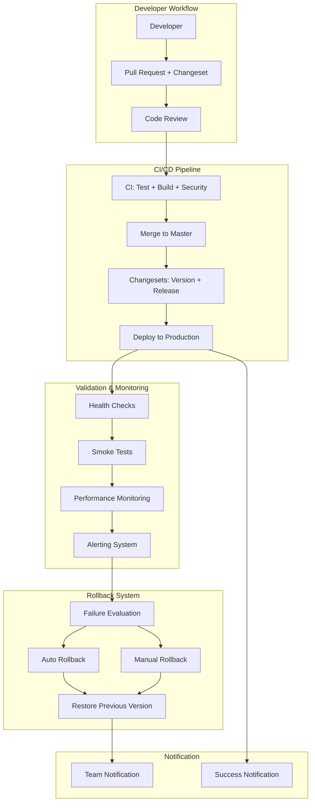
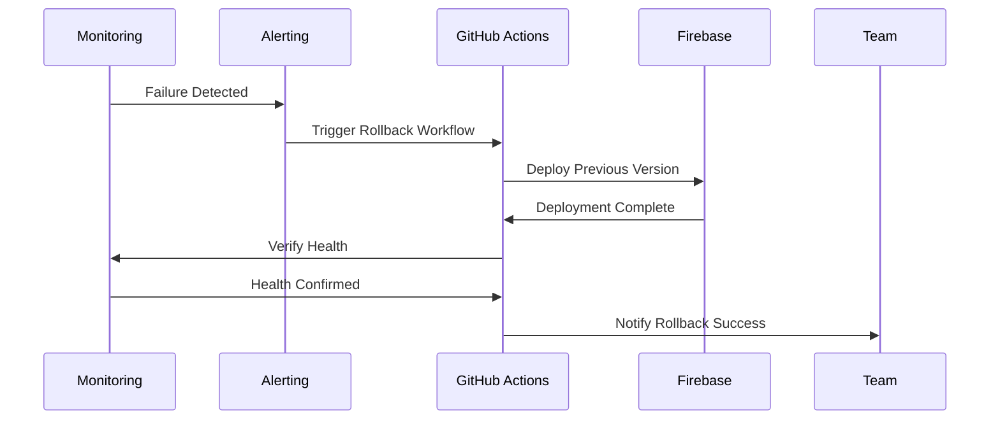

# System Architecture: Changesets & Automated Release Management

> **Enterprise-Grade Deployment Pipeline with Automated Release Management and Rollback Capabilities**

## 🏗️ Architecture Overview

The Sacred Sutra Tools deployment pipeline implements a comprehensive, automated release management system built around semantic versioning, continuous integration, automated deployment, and intelligent rollback capabilities.

### Core Design Principles

1. **Zero-Touch Deployment**: Complete automation from code commit to production deployment
2. **Semantic Versioning**: Automated version management using changesets
3. **Fast Recovery**: <2 minute rollback capabilities with automated failure detection
4. **Comprehensive Monitoring**: Real-time health monitoring with proactive alerting
5. **Developer Experience**: Streamlined developer workflow with minimal friction

## 🎯 System Components



## 📦 Component Architecture

### 1. Changesets Foundation

**Purpose**: Semantic versioning and automated changelog generation

**Components**:
- `@changesets/cli` - Core changeset management
- `@changesets/changelog-github` - GitHub-integrated changelogs
- Configuration in `.changeset/config.json`

**Workflow**:
1. Developer creates changeset with `npx changeset`
2. Changeset describes changes and version impact (patch/minor/major)
3. PR includes changeset file for review
4. On merge, changesets automatically bumps version and creates release

**Configuration**:
```json
{
  "changelog": "@changesets/changelog-github",
  "commit": false,
  "baseBranch": "master",
  "updateInternalDependencies": "patch"
}
```

### 2. CI/CD Pipeline System

**Architecture**: Five GitHub Actions workflows with distinct responsibilities

#### Workflow 1: Continuous Integration (`ci.yml`)
**Trigger**: Push and Pull Request events
**Purpose**: Quality gates before merge

**Pipeline Stages**:
```yaml
1. Environment Setup (Node.js 18, dependency caching)
2. Security Audit (npm audit, dependency scanning)
3. Code Quality (ESLint, TypeScript validation)
4. Testing Suite (Jest unit tests, coverage reporting)
5. Build Verification (Vite production build)
```

#### Workflow 2: Release Management (`release.yml`)
**Trigger**: Push to master branch
**Purpose**: Automated version management and GitHub releases

**Pipeline Stages**:
```yaml
1. Environment Setup
2. Changeset Detection
3. Version Bump (if changesets detected)
4. GitHub Release Creation
5. Changelog Update
6. Tag Creation
```

#### Workflow 3: Deployment (`deploy.yml`)
**Trigger**: GitHub Release published
**Purpose**: Production deployment to Firebase Hosting

**Pipeline Stages**:
```yaml
1. Environment Setup
2. Production Build
3. Firebase Deployment
4. Deployment Verification
5. Success Notification
```

#### Workflow 4: Deployment Validation (`deployment-validation.yml`)
**Trigger**: Deploy workflow completion
**Purpose**: Post-deployment health verification

**Pipeline Stages**:
```yaml
1. Deployment Wait (60 seconds)
2. Health Check Validation
3. Smoke Test Execution
4. Performance Benchmarking
5. Failure Reporting (GitHub Issues)
```

#### Workflow 5: Emergency Rollback (`rollback.yml`)
**Trigger**: Manual dispatch
**Purpose**: Emergency rollback capabilities

**Pipeline Stages**:
```yaml
1. Previous Version Detection
2. Firebase Rollback Execution
3. Health Check Verification
4. Team Notification
5. Incident Documentation
```

### 3. Validation & Health Check System

**Multi-Tier Validation Strategy**:

#### Tier 1: Application Health Checks
- **Endpoint**: `/health` and `/flipkart-amazon-tools/health`
- **Checks**: Application status, routing, basic functionality
- **Response Time**: <100ms target
- **React Component**: Real-time health dashboard with metrics

#### Tier 2: Smoke Tests
- **Script**: `scripts/smoke-tests.js`
- **Coverage**: Critical user flows, authentication, key features
- **Execution**: Post-deployment automated testing
- **Retry Logic**: 3 attempts with exponential backoff

#### Tier 3: Performance Monitoring
- **Metrics**: Core Web Vitals (LCP, FID, CLS)
- **Thresholds**: LCP <2.5s, FID <100ms, CLS <0.1
- **Monitoring**: Continuous performance tracking
- **Alerting**: Performance degradation detection

### 4. Monitoring & Alerting Infrastructure

#### Application Monitoring (`monitoring.service.ts`)
**Features**:
- Error tracking and aggregation
- Performance metrics collection
- User analytics and session tracking
- Custom event tracking
- Environment-aware data collection

**Data Collection**:
```typescript
interface MonitoringData {
  errors: ErrorEntry[];
  performance: PerformanceEntry[];
  analytics: AnalyticsEntry[];
  sessions: SessionEntry[];
}
```

#### Alerting System (`alerting.service.ts`)
**Alert Rules**:
- **Critical Errors**: Error rate > 5% in 5-minute window
- **Performance Degradation**: Response time > 3x baseline
- **Availability Issues**: Health check failures
- **Security Events**: Authentication failures spike

**Notification Channels**:
- GitHub Issues (automated incident creation)
- Console logging (development)
- Future: Slack, email, PagerDuty integration

### 5. Rollback & Recovery System

#### Automated Rollback Triggers
1. **Health Check Failures**: 3 consecutive failures
2. **Performance Degradation**: Response time >3x baseline for 5 minutes
3. **Error Rate Spike**: Error rate >5% for 5 minutes
4. **Manual Trigger**: Emergency situations

#### Rollback Process


## 🔐 Security Architecture

### CI/CD Security
- **Secrets Management**: GitHub Secrets for sensitive data
- **Environment Protection**: Production environment requires approval
- **Dependency Scanning**: npm audit in CI pipeline
- **Code Scanning**: ESLint security rules

### Application Security
- **Error Boundary**: React error containment
- **Monitoring**: Security event tracking
- **Environment Detection**: Secure configuration management

## 📊 Performance Architecture

### Build Performance
- **Dependency Caching**: npm cache across workflow runs
- **Incremental Builds**: Vite's optimized build process
- **Parallel Processing**: Multiple workflow jobs where applicable

### Runtime Performance
- **Core Web Vitals Monitoring**: Real-time performance tracking
- **Performance Budgets**: Automated performance regression detection
- **Lazy Loading**: Component-level code splitting

### Deployment Performance
- **Firebase CDN**: Global content delivery
- **Static Asset Optimization**: Vite build optimizations
- **Rollback Speed**: <2 minute recovery time target

## 🎚️ Scalability Considerations

### Pipeline Scalability
- **Workflow Concurrency**: Multiple simultaneous deployments supported
- **Resource Management**: Efficient CI/CD resource utilization
- **Monitoring Scalability**: localStorage-based storage (demo) with cloud migration path

### Application Scalability
- **Component Architecture**: Modular, scalable React architecture
- **State Management**: Efficient state management patterns
- **Performance Monitoring**: Scalable monitoring infrastructure

## 🚨 Disaster Recovery

### Recovery Time Objectives (RTO)
- **Application Recovery**: <2 minutes (automated rollback)
- **Manual Recovery**: <5 minutes (manual rollback)
- **Full System Recovery**: <15 minutes (complete rebuild)

### Recovery Point Objectives (RPO)
- **Code Recovery**: <1 minute (Git-based)
- **Configuration Recovery**: <1 minute (IaC approach)
- **Data Recovery**: N/A (stateless application)

### Backup Strategy
- **Code**: Git repositories (primary + GitHub backup)
- **Configuration**: Version controlled infrastructure
- **Build Artifacts**: Firebase versioning + GitHub releases
- **Documentation**: Git-based documentation system

## 🔄 Integration Architecture

### GitHub Integration
- **Actions**: Complete CI/CD pipeline automation
- **Releases**: Automated release creation and management
- **Issues**: Automated incident reporting
- **Pull Requests**: Workflow integration and status checks

### Firebase Integration
- **Hosting**: Production deployment target
- **Rollback**: Version-based rollback capabilities
- **Configuration**: Project-based environment management

### Development Tools Integration
- **Package Management**: npm with lock file consistency
- **Testing**: Jest for unit testing, Playwright for E2E
- **Linting**: ESLint with TypeScript support
- **Building**: Vite for optimized production builds

## 🔧 Maintenance Architecture

### Automated Maintenance
- **Dependency Updates**: Automated security updates
- **Health Monitoring**: Continuous application health checks
- **Performance Monitoring**: Ongoing performance tracking
- **Log Management**: Automated log rotation and cleanup

### Manual Maintenance
- **Documentation Updates**: Regular documentation reviews
- **Security Reviews**: Periodic security assessments
- **Performance Tuning**: Regular performance optimization
- **Disaster Recovery Testing**: Quarterly DR tests

## 📚 Technology Stack

### Core Technologies
- **Frontend**: React 18 + TypeScript + Vite
- **Hosting**: Firebase Hosting
- **CI/CD**: GitHub Actions
- **Version Management**: Changesets
- **Testing**: Jest + Playwright

### Infrastructure Tools
- **Monitoring**: Custom monitoring service
- **Alerting**: Custom alerting system
- **Health Checks**: Custom health endpoints
- **Rollback**: Firebase hosting versions

### Development Tools
- **Linting**: ESLint + TypeScript
- **Formatting**: Prettier (via ESLint)
- **Git Hooks**: Husky for pre-commit checks
- **Documentation**: Markdown + Mermaid diagrams

## 🔮 Future Considerations

### Monitoring Enhancements
- **External Monitoring**: Integration with UptimeRobot, Pingdom
- **Advanced Analytics**: User behavior tracking
- **APM Integration**: Application Performance Monitoring tools
- **Log Aggregation**: Centralized logging solution

### Deployment Enhancements
- **Multi-Environment**: Staging environment deployment
- **Feature Flags**: Progressive feature rollout
- **A/B Testing**: Deployment-based testing framework
- **Blue-Green Deployment**: Zero-downtime deployment strategy

### Security Enhancements
- **SAST/DAST**: Advanced security scanning
- **Dependency Management**: Automated dependency updates
- **Compliance**: SOC 2, PCI compliance considerations
- **Threat Modeling**: Regular security assessments

---

## Architecture Decision Records (ADRs)

### ADR-001: Changesets for Version Management
**Decision**: Use @changesets/cli for semantic versioning
**Rationale**: Automated, developer-friendly, integrates with GitHub
**Status**: Implemented

### ADR-002: GitHub Actions for CI/CD
**Decision**: Use GitHub Actions over other CI/CD platforms
**Rationale**: Native GitHub integration, free for public repos, extensive ecosystem
**Status**: Implemented

### ADR-003: Firebase Hosting for Deployment
**Decision**: Continue using Firebase Hosting
**Rationale**: Existing infrastructure, good performance, easy rollback
**Status**: Implemented

### ADR-004: Custom Monitoring vs External Services
**Decision**: Implement custom monitoring with external service documentation
**Rationale**: Full control, no external dependencies for demo, future migration path
**Status**: Implemented

---

*This architecture supports enterprise-grade deployment practices while maintaining simplicity and developer productivity.* 