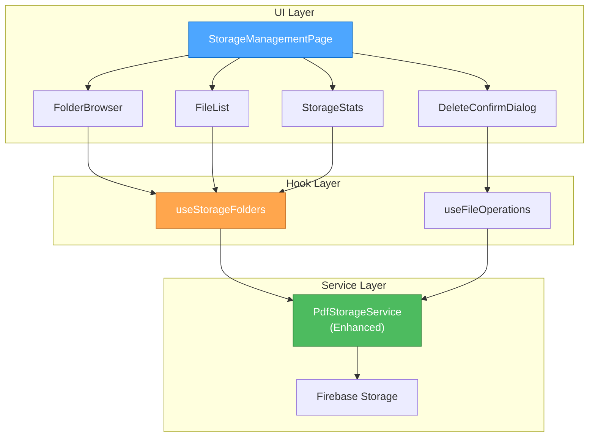

# Creative Phase: Firebase Storage Management Page

> **Document Purpose:** This document captures the design decisions for the Firebase Storage Folder Management Page, exploring UI/UX and architectural options to create an intuitive and efficient storage management interface.

---

🎨🎨🎨 **ENTERING CREATIVE PHASE: UI/UX DESIGN** 🎨🎨🎨

## UI/UX DESIGN PHASE

### Problem Statement
Design an intuitive interface for users to browse, view, and delete their Firebase Storage folders and files. The interface must be:
- Easy to navigate through folder hierarchies
- Clear about file actions and their consequences
- Responsive for both desktop and mobile users
- Consistent with the existing Sacred Sutra Tools design
- Safe against accidental deletions

### User Needs Analysis
**Primary Users:** Sacred Sutra Tools users who have uploaded PDF files
**Key User Stories:**
- As a user, I want to see all my uploaded files organized by folders so I can find specific documents
- As a user, I want to delete individual files to manage my storage space
- As a user, I want to delete entire folders when they're no longer needed
- As a user, I want clear confirmations before deleting to avoid mistakes
- As a user, I want to see file details (size, date, etc.) to make informed decisions

### UI/UX Options Analysis

#### Option 1: Hierarchical Tree View with Details Panel
**Description:** Left sidebar with expandable folder tree, right panel showing file details and actions

**Pros:**
- Familiar pattern from file explorers
- Clear hierarchy visualization
- Dedicated space for file metadata
- Easy navigation between folders

**Cons:**
- Takes significant horizontal space
- May be complex on mobile devices
- Requires responsive design adaptation

**Complexity:** Medium
**Implementation Time:** 4-6 hours
**Style Guide Alignment:** High (follows Material-UI patterns)

#### Option 2: Breadcrumb Navigation with Grid View
**Description:** Breadcrumb navigation at top, folder/file grid below with action overlays

**Pros:**
- Mobile-friendly responsive design
- Clean, minimal interface
- Familiar grid pattern for files
- Clear navigation path

**Cons:**
- Limited metadata visibility
- Requires drilling down for nested folders
- May need pagination for large folders

**Complexity:** Low-Medium
**Implementation Time:** 3-4 hours
**Style Guide Alignment:** High (card-based design)

#### Option 3: Hybrid List View with Inline Actions
**Description:** Single-column list with folder icons, inline metadata, and action buttons

**Pros:**
- Excellent mobile experience
- Clear file information display
- Efficient use of vertical space
- Direct action access

**Cons:**
- Limited folder hierarchy visualization
- May become cluttered with many actions
- Scrolling required for large folders

**Complexity:** Low
**Implementation Time:** 2-3 hours
**Style Guide Alignment:** High (list-based patterns)

### UI/UX Decision

**Selected Option: Option 2 - Breadcrumb Navigation with Grid View**

**Rationale:**
- Best balance of usability and technical feasibility
- Excellent mobile responsiveness aligns with user base
- Clean, uncluttered interface reduces cognitive load
- Grid pattern is familiar to users from file browsers
- Breadcrumb navigation provides clear location context
- Card-based design matches existing application patterns

**Implementation Guidelines:**
1. **Layout Structure:**
   - Header with breadcrumb navigation
   - Main grid area with folder/file cards
   - Floating action button for bulk operations
   - Bottom sheet for mobile actions

2. **Visual Hierarchy:**
   - Folders displayed before files
   - Clear visual distinction between folders and files
   - File size and date prominently displayed
   - Action buttons with clear icons and labels

3. **Interaction Patterns:**
   - Single tap/click to select
   - Double tap/click to open folders
   - Long press for context menu (mobile)
   - Hover states for desktop interactions

4. **Responsive Design:**
   - Grid adapts from 4 columns (desktop) to 2 (tablet) to 1 (mobile)
   - Touch-friendly button sizes (44px minimum)
   - Swipe gestures for mobile actions

🎨 **CREATIVE CHECKPOINT: UI/UX Design Completed**

---

🎨🎨🎨 **ENTERING CREATIVE PHASE: ARCHITECTURE DESIGN** 🎨🎨🎨

## ARCHITECTURE DESIGN PHASE

### Architecture Challenge
Design a scalable and efficient system for managing Firebase Storage folders and files, including:
- Efficient folder structure retrieval from Firebase Storage
- Safe deletion operations with proper error handling
- Optimized caching for large folder structures
- Component architecture that supports the chosen UI pattern

### System Requirements
- **Performance:** Handle folders with 100+ files efficiently
- **Security:** Ensure users can only access their own folders
- **Reliability:** Robust error handling and recovery
- **Scalability:** Support future enhancements (search, filters, etc.)
- **Maintainability:** Clear separation of concerns

### Architecture Options Analysis

#### Option 1: Service-First Architecture with Redux State Management
**Description:** Enhanced storage service with Redux for state management and caching

**Components:**
- Enhanced `PdfStorageService` with folder operations
- Redux slice for folder/file state management
- React components with hooks for state access
- Custom hooks for complex operations

**Pros:**
- Centralized state management
- Excellent caching capabilities
- Predictable state updates
- Easy debugging with Redux DevTools
- Supports offline capabilities

**Cons:**
- Additional Redux boilerplate
- Larger bundle size
- Complexity for simple operations
- Potential over-engineering for this feature

**Technical Fit:** High
**Complexity:** High
**Scalability:** High

#### Option 2: React Query with Service Layer
**Description:** Service layer with React Query for data fetching and caching

**Components:**
- Enhanced `PdfStorageService` for Firebase operations
- React Query hooks for data management
- Component-level state for UI state
- Custom hooks for business logic

**Pros:**
- Excellent caching and synchronization
- Built-in loading and error states
- Optimistic updates support
- Smaller learning curve
- Great developer experience

**Cons:**
- Additional dependency (React Query)
- Less predictable than Redux
- Cache invalidation complexity
- Potential conflicts with existing Redux

**Technical Fit:** Medium-High
**Complexity:** Medium
**Scalability:** High

#### Option 3: Simple useState with Service Layer
**Description:** React component state with enhanced service layer

**Components:**
- Enhanced `PdfStorageService` for all operations
- Component-level state management
- Custom hooks for reusable logic
- Simple caching with localStorage

**Pros:**
- Minimal complexity and dependencies
- Easy to understand and maintain
- Fast implementation
- Leverages existing patterns
- No additional bundle size

**Cons:**
- Limited caching capabilities
- Manual state synchronization
- Potential performance issues with large data
- Less sophisticated error handling

**Technical Fit:** High
**Complexity:** Low
**Scalability:** Medium

### Architecture Decision

**Selected Option: Option 3 - Simple useState with Service Layer**

**Rationale:**
- **Simplicity:** Aligns with project's preference for straightforward solutions
- **Existing Patterns:** Builds on current codebase patterns
- **Performance:** Adequate for expected usage patterns
- **Maintainability:** Easy for team to understand and maintain
- **Time to Market:** Fastest implementation path
- **Bundle Size:** No additional dependencies required

**Component Architecture:**



**Service Layer Enhancements:**

1. **New Methods for PdfStorageService:**
   ```typescript
   // Folder operations
   async listUserFolders(): Promise<FolderInfo[]>
   async listFolderContents(folderPath: string): Promise<FileInfo[]>
   async getFolderSize(folderPath: string): Promise<number>
   
   // Deletion operations
   async deleteFolderRecursive(folderPath: string): Promise<void>
   async deleteFile(filePath: string): Promise<void>
   async deleteMultipleFiles(filePaths: string[]): Promise<void>
   
   // Utility operations
   async validateUserAccess(path: string): Promise<boolean>
   ```

2. **Data Models:**
   ```typescript
   interface FolderInfo {
     path: string;
     name: string;
     fileCount: number;
     totalSize: number;
     lastModified: Date;
   }
   
   interface FileInfo {
     path: string;
     name: string;
     size: number;
     lastModified: Date;
     downloadUrl: string;
   }
   ```

**Implementation Strategy:**

1. **Phase 1: Service Enhancement**
   - Extend PdfStorageService with folder operations
   - Implement proper error handling and user validation
   - Add comprehensive logging for debugging

2. **Phase 2: Core Components**
   - Create StorageManagementPage with breadcrumb navigation
   - Implement FolderBrowser for grid-based folder display
   - Build FileList component for file display

3. **Phase 3: User Operations**
   - Add DeleteConfirmDialog with preview functionality
   - Implement batch operations for multiple selections
   - Add progress indicators for long operations

4. **Phase 4: Polish & Integration**
   - Add StorageStats for usage overview
   - Integrate with app navigation and routing
   - Implement responsive design optimizations

**Caching Strategy:**
- Component-level caching with useState
- localStorage for recently accessed folders
- Manual cache invalidation after operations
- Optimistic updates for better UX

**Error Handling:**
- Service-level error catching and transformation
- Component-level error boundaries
- User-friendly error messages
- Retry mechanisms for network failures

🎨 **CREATIVE CHECKPOINT: Architecture Design Completed**

---

🎨🎨🎨 **EXITING CREATIVE PHASE - DESIGN DECISIONS MADE** 🎨🎨🎨

## Creative Phase Summary

### UI/UX Design Decision
- **Selected:** Breadcrumb Navigation with Grid View
- **Key Features:** Mobile-first responsive design, clear folder hierarchy, grid-based file display
- **Implementation:** Material-UI components with existing theme integration

### Architecture Design Decision  
- **Selected:** Simple useState with Enhanced Service Layer
- **Key Features:** Minimal complexity, enhanced PdfStorageService, component-level state management
- **Implementation:** Build on existing patterns, no additional dependencies

### Next Steps
Both creative phases are now complete. The feature is ready for implementation with clear design guidelines and architectural decisions documented.

**Ready for IMPLEMENT MODE** ✅ 