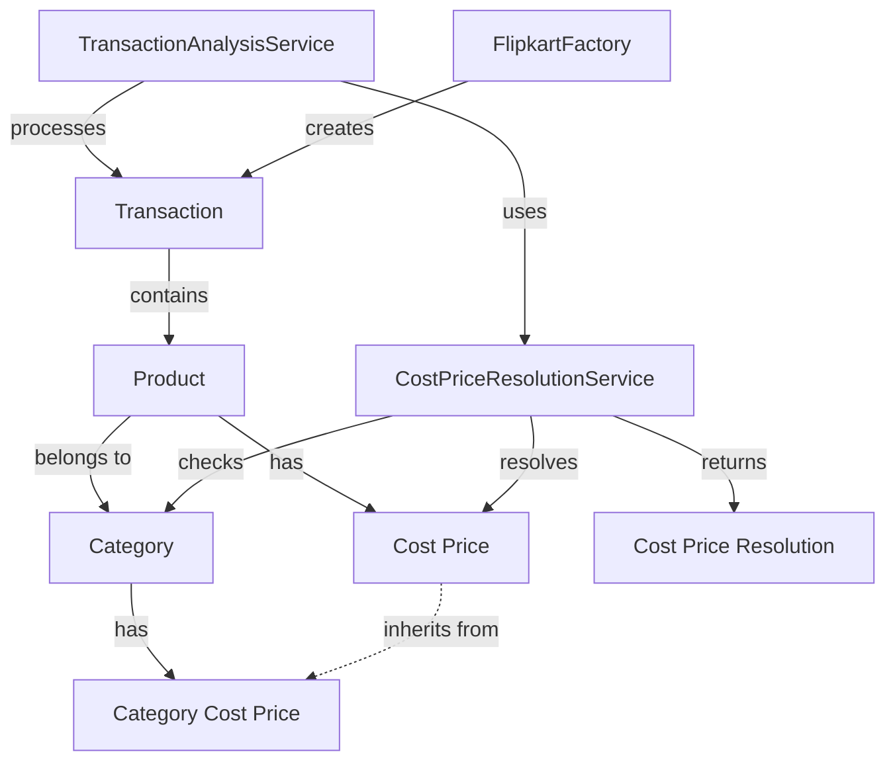

# DETAILED IMPLEMENTATION PLAN: TRANSACTION ANALYTICS REPAIR

## Issue Analysis

1. **TransactionAnalysisService Issues**:
   - Does not integrate with CostPriceResolutionService
   - Uses direct product.costPrice without inheritance logic
   - Profit calculations incorrectly calculate total cost without considering quantity
   - No indication of cost price source in results

2. **FlipkartFactory Issues**:
   - Product object creation does not set up category ID
   - No integration with CostPriceResolutionService
   - Cost price is hardcoded to 0 in product creation
   - May be missing fields needed for proper category inheritance

3. **UI Component Issues**:
   - Transaction analytics table not showing cost price source
   - Calculations display may be incorrect due to backend issues
   - Missing explanatory information about price inheritance
   - Inconsistent currency formatting


## Implementation Approach

### 1. TransactionAnalysisService Updates

Update the TransactionAnalysisService to integrate with CostPriceResolutionService and fix calculation errors:

```typescript
// Add CostPriceResolutionService dependency
constructor(
  transactions: Transaction[],
  productPrices: Map<string, ProductPrice>,
  private costPriceService: CostPriceResolutionService
) {
  // Existing code...
}

// Add method to resolve cost prices
private async resolveCostPrices(): Promise<Map<string, CostPriceResolution>> {
  const costPrices = new Map<string, CostPriceResolution>();
  for (const transaction of this.transactions) {
    if (!costPrices.has(transaction.sku)) {
      const resolution = await this.costPriceService.getProductCostPrice(transaction.sku);
      costPrices.set(transaction.sku, resolution);
    }
  }
  return costPrices;
}

// Update analyze method to be async
async analyze(): Promise<TransactionSummary> {
  const costPrices = await this.resolveCostPrices();
  const summary: TransactionSummary = {
    // Initialize summary object
  };
  
  // Process with resolved cost prices
  // Fix calculations for profit and cost
}
```

### 2. FlipkartFactory Updates

Modify FlipkartFactory to properly handle category inheritance:

```typescript
// Update product initialization in rowToTransaction
private rowToTransaction(order: FlipkartOrderData): Transaction | null {
  if (!order["Order ID"]) return null;

  return {
    // Existing fields...
    product: {
      name: order["SKU Name"] || "",
      sku: order["SKU Name"],
      description: order["SKU Name"] || "",
      platform: "flipkart",
      categoryId: order["Category ID"] || undefined, // Add category ID if available
      customCostPrice: null, // Use null to enable inheritance
      sellingPrice: this.parseCurrencyValue(order["Final Selling Price (incl. seller opted in default offers)"]),
      // Other existing fields...
    },
    // Remaining fields...
  };
}
```

### 3. UI Component Updates

Update the UI components to properly display cost price sources and calculations:

```tsx
// Add cost price source display to product-list.component.tsx
<TableRow key={product.sku}>
  {/* Existing columns */}
  <TableCell>
    {product.costPriceSource || "Default"}
    <Tooltip title="Cost price source indicates whether the price comes from the product directly, is inherited from a category, or uses a default value.">
      <InfoIcon fontSize="small" color="action" sx={{ ml: 1, fontSize: 16 }} />
    </Tooltip>
  </TableCell>
  {/* Other columns */}
</TableRow>
```


## Code Architecture




## Implementation Plan and Sequence

1. **Update TransactionAnalysisService**
   - Add CostPriceResolutionService dependency
   - Implement cost price resolution method
   - Make analyze() method async
   - Fix calculation logic for costs, profits, and profit per unit
   - Add cost price source to the output

2. **Update FlipkartFactory**
   - Modify rowToTransaction method
   - Add category ID handling
   - Set customCostPrice to null for inheritance
   - Ensure product properties are properly initialized

3. **Update UI Components**
   - Add cost price source display
   - Improve formatting of currency values
   - Add explanatory tooltips
   - Update to handle async data flow

4. **Testing**
   - Test with sample Flipkart import file
   - Verify calculations match expected values
   - Test with various cost price inheritance scenarios
   - Validate UI display of all values


## Technical Decisions

1. **Make analyze() Async**: Required to support cost price resolution, which may need database access

2. **Cache Resolved Cost Prices**: Use a Map to store resolved prices by SKU to avoid redundant resolution

3. **CostPriceResolution Object**: Include both value and source information to display in the UI

4. **Null Custom Cost Price**: Ensure products created use null for customCostPrice to enable inheritance

5. **Transaction Flow**: Keep the existing transaction flow but enhance with cost price resolution

